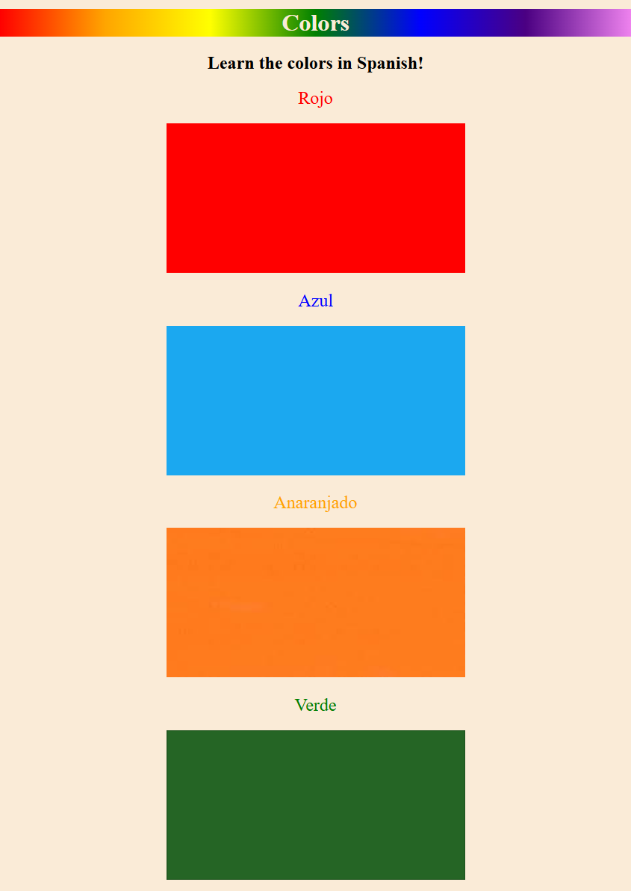

# Section 5: Introduction to CSS

## Key Points / What I Learned

- **How to add CSS** (Cascading Style Sheets) - 3 Ways
    - **Inline** - `style` Attribute (goes inside the opening tag)
        1) Format
        ```html
        <tag style="css-property: value;"></tag>
        ```
        2) Example
        ```html
        <html style="background: blue">
        </html>
        <!-- Use for: a single element
        Avoid for: entire pages -->
        ```
    - **Internal** - Special HTML tag `<style>` inside the `<head>` section
        1) Format
        ```html
        <style>selector{css-property: value;}</style>
        ```
        2) Example
        ```html
        <html>
            <head>
                <style>
                    html{  
                        background:red;
                    }
                </style>
            </head>
        </html>
        <!-- html inside style element is called a selector -->
        <!-- Use for: single-page styling
        Avoid for: multi-page websites -->
        ```
    - **External** - Separate File `style.css`
        1) HTML Format
        ```html
        <link href="style.css"/>
        ```
        2) Example
        ```html
        <!-- Content of HTML file - to link the CSS file -->
        <html>
            <head>
                <link
                    rel="stylesheet"
                    href=./styles.css
                />
            </head>
        </html>
        ```
        ```css
        /* Content of the CSS file */
        html{
            background:green;
        }
        ```
- **CSS Selectors** - Choosing Where to Apply CSS

    - **Element Selector**  
        Targets all elements of a specific HTML tag.
        ```css
        h1{color: blue;}  
        p{color: red;} /* if you have more than one paragraph element, it applies to all */
        ```
    - **Class Selector**  
        Targets elements with a specific class, used to group elements
        ```css
        .red-text{color: red;}
        ```
        ```html
        <h2 class="red-text">Heading 2</h2>
        <h3>Heading 3</h3>
        <p class="red-text">Paragraph</h2>
        ```
    - **Id Selector**  
        Targets a single unique element.
        ```css
        #main{color: red;}
        ```
        ```html
        <!-- the id must be unique, only one element can have a specific id (e.g., "main"). -->
        <h2 id="main">Red</h2>
        <h2>Green</h2>
        <h2>Blue</h2>
        ```
    - **Attribute Selector**  
        Targets elements based on attributes or attribute values.
        ```css
        p[draggable]{color: red;} /* selects the first two */
        p[draggable="false"]{color: red;} /* selects only the second one */
        ```
        ```html
        <p draggable="true">Drag me</p>
        <p draggable="false">Don't drag me</p>
        <p>Don't drag me</p>
        ```
    - **Universal Selector**  
        Targets all elements on the page.
        ```css
        *{color: red;}
        ```


## List Element - `value` attribute in orderded lists
- [MDN Web Docs – List Element](https://developer.mozilla.org/en-US/docs/Web/HTML/Reference/Elements/li)


## Project : Colour Vocab Website 
A basic website to learn colors in Spanish, displaying color names with matching colored boxes.

