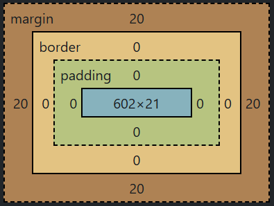

# Section 6: CSS Properties

## Project : Motivational Poster Project
A motivational poster website with image, headline, and text.


## Key Points / What I Learned

- **Color Properties**
    ```css
    selector{property: value}
    html{background-color: red;}
    h1{color: blue;}  /* text color */
    ```

- **CSS Colors** - Different Ways of Representing Them
    - **Named Colors**
        ```css
        p{color: purple;}
        ```

    - **Hex Codes**
        ```css
        p{color: #5D3891;}
        ```

    - **RGB Values**
        ```css
        /* Format: rgb(red, green, blue) */
        p{color: rgb(93, 56, 145);}  /* values range from 0 to 255 */
        ```
        RGBA (with transparency)
        ```css
        p {color: rgba(93, 56, 145, 0.5);}  /* a = alpha (opacity), from 0 to 1 */
        ```

- **Font Properties**
    ```css
    h1{
        color: blue; 
        font-size: 20px;
        font-weight: bold;
        font-family: sans-serif  /*typeface*/
    }
    ```

    - **Font Size - Units**  
        `1px` - pixel  
        `1pt` - point (slightly bigger than a pixel)  
        `1em` - 100% of parent (relative size)   
        `1rem` - 100% of root  (relative to the html element)  
        Named sizes: `xx-small`, `x-small`, `small`,`medium`, `large`, `x-large`, `xx-large`
        ```html
        <body> <!-- font-size is 20px -->
            <h1>Hello</h1>
        </body>
        ```
        ```css
        h1{text-size: 2em}  /* 2 × parent size → 20px × 2 = 40px */
        ```

    - **Font Weight - Values**  
        Keywords: `normal`, `bold`  
        Relative to Parent: `lighter`, `bolder` (changes weight by ~100 relative to parent)   
        Number: `100-900`

    - **Font Family**
        ```css
        h1{
            font-family: Helvetica, sans-serif  
        } /* Helvetica: Mac-specific typeface, sans-serif: generic (backup) font type*/
        h2{
            font-family: "Times New Roman", serif
        } /* If there are spaces in the name of the font-family we need quotation marks around it */
        ```
    
- **Text Align**  
  Options: `left`, `right`, `center`, `start`, `end`
    ```css
    h1{text-align: center}
    ```

- **CSS Inspection**  
    Chrome Developer Tools: `...> More Tools > Developer Tools > Elements > Styles`   
    Shortcuts: `Ctrl + Shift + I` / `F12`  
    Inspect specific element: `Right-click` > `Inspect`  
    **CSS Overview**: check colors, fonts, and other styles

- **The Box Model**  
    The invisible box around each element that affects layout
    <p align="left">
        
    </p>

    - **Margin Property**  
        Adds space outside the border of an element(outside the element’s box), between the element and other elements

    - **Padding Property**  
       Adds space between the content and the border (inside the element’s box)

    - **Border Property**  
        A line that surrounds an element
        ```css
        h1{
            border:10px solid black; /* thickness, style(solid or dashed), color */
            border-top: 0px; /* more specific rule for one side */
            border-width: 0px 10px 20px 30px; /*top, right, bottom, left (clockwise) */
            border-width: 0px 20px; /* top/bottom = 0px, right/left = 20px */
            }
        ```

- **Content Division Element**  
    Groups elements together into separate sections or boxes (invisible by default)
    ```html
    <body>
        <div>
            <p>Hello World</p>
            
        </div>
        <div>
            <p>Good Night World</p>
            
        </div>
    </body>
    ```


## Documentation for Named Colors
- [MDN Web Docs - Named Colors](https://developer.mozilla.org/en-US/docs/Web/CSS/Reference/Values/named-color)

## Professionally Designed Color Palettes
- [Color Hunt](https://colorhunt.co/)

## RBG Colour Sliders
- [RGB Colour Mixer - Used by Screens](https://www.csfieldguide.org.nz/en/interactives/rgb-mixer/)

## Custom Fonts
- [Google Fonts](https://fonts.google.com/)

## CSS Debugging Tool – Outline Every Element
- [Pesticide Chrome Extension](https://chromewebstore.google.com/detail/pesticide/bakpbgckdnepkmkeaiomhmfcnejndkbi?pli=1)
