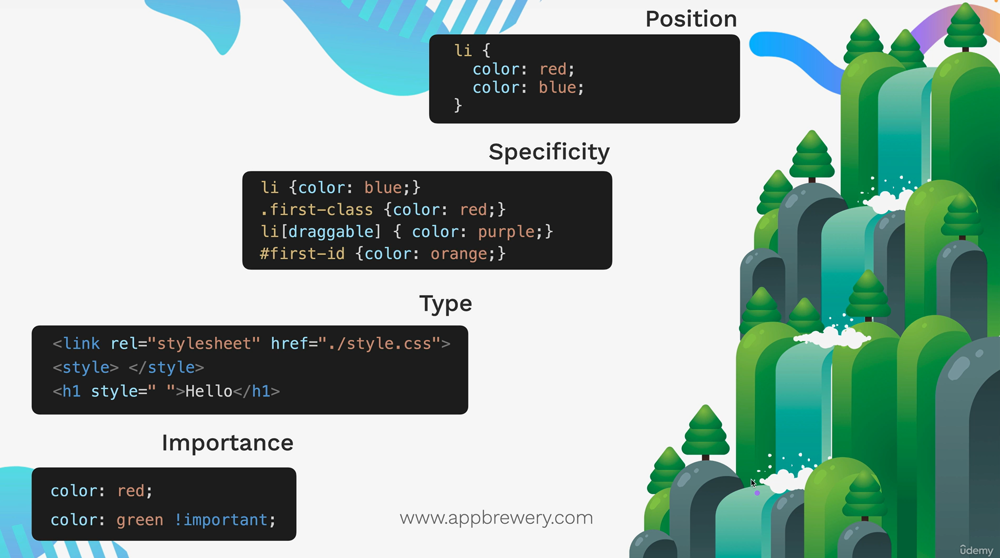

# Section 7: Intermediate CSS

## Project : Flag Project
Recreated the national flag of Laos using pure CSS.


## Key Points / What I Learned

- **CSS Cascade** - Importance Order

    1) **Position**
        ```css
        li {
            color: red;
            color: blue; /* blue replaces red → last/lower rule wins */
        }  
        ```
    2) **Specificity**
        ```html
        <li id="first-id" class="first-class" draggable>List Item</li>
        <li>Another List Item</li>
        ```
        ```css
        li {color: blue;} /* lowest specificity */
        .first-class {color: red;}
        li[draggable] {color:purple;}
        #first-id {color: orange;} /* highest specificity */
        ```
    3) **Type**  
    <u>Level of Hierarchy</u> --> External stylesheet < Internal stylesheet < Inline styles (highest priority)
        ```html
        <ol>
            <li>One</li>
            <li style="color: red">Two</li>
            <li>Three</li>
        </ol>
        ```
        ```css
        li {
            color: green;
        }
        /* External stylesheet gets overridden by the inline one due to higher priority. */
        ```
    4) **Importance** - `!important` keyword
        ```css
            color: red;
            color: green !important; /* highest priority */
        ```

    <p align="center">
        
    </p>

- **Combining CSS Selectors** - Different Ways
    - **Grouping Selector** = Apply to direct child of left side
        ```css
        selector, selector {color: blueviolet;}
        /* multiple selectors get the same style */
        ```
    - **Child Selector** = Apply to the child of another selector
        ```css
        parent_selector > child_selector {color: firebrick;}
        /* only selects immediate children (one level deep) */
        ```
    - **Descendant Selector** = Apply to a descendant of left side
        ```css
        ancestor_selector descendant_selector {color: blue;}
        /* selects elements nested at any level inside the ancestor (as many levels deep) */
        ```
    - **Chaining (Compound) Selector** = Apply where ALL selectors are true
        ```css
        selectorselector {color: seagreen;}
        /* Always start with the element name, then add class or id */
        div.highlighted#main { color: seagreen;}
        /* selects <div> elements that:
        1. have the class "highlighted"
        2. AND have the id "main" */
        ```
    - **Combining Selectors**
        ```css
        selector selectorselector {font-size: 2rem;}
        /* combines different selectors: (e.g., descendant + chaining) */
        ```

- **CSS Position**
    - **Static Positioning**  
        This is the default layout behavior. Elements follow the normal document flow (stack vertically)  
        `top`, `left`, `right`, `bottom` do not work here.
        ```css
        position: static; /* it's applied by default to all elements */
        ```
    - **Relative Positioning**  
        Element is positioned relative to its normal (static) position
        ```css
        position: relative; /* position relative to its default position */
        left: 50px;
        top: 50px;
        ```
    - **Absolute Positioning**  
        Position relative to nearest positioned ancestor (that is not `static`), or top left corner of webpage  
        Looks for the closest positioned ancestor (`relative`, `absolute`, `fixed`, or `sticky`).
        ```html
        <div id="ancestor">
            <div id="descendant">
                <p>Hello</p>
            </div>
        </div>
        ```
        ```css
        #ancestor {
            position: relative;
        }

        #descendant {
            position: absolute;  /* its position will be relative to its nearest positioned ancestor */
            top: 50px;
            left: 50px;
        }
        /** if it doesn't have a positioned ancestor, then the second rule becomes valid **/
        ```
    - **Fixed Positioning**  
        Position relative to top left corner of browser window  
        Does not move when scrolling
        ```css
        position: relative;
        top: 50px;
        left: 50px;
        ```

- **Z-Index**  
    Controls stacking order (front ↔ back) on the Z-axis  
    Works only on positioned elements (`position` ≠ `static`)

    ```css
    /* Everything on screen has a default z-index of zero (auto).
    Higher value → appears on top.
    Negative values → go behind others. */
    img {z-index: -1;} /* the img element goes behind everything else */
    ```
- **Creating a Cirle in CSS**
    ```css
    .red-circle {  /* red-cicle class --> div element */
        background-color: red;
        width: 200px;
        height: 200px;
        border-radius: 50%;  /* creates a circle (if width and height are equal) */
    }  
    /* you can also use px values to round the corners as much as you want */
    ```


## Different CSS Positioning Examples
- [CSS Positioning - Demo Website](https://appbrewery.github.io/css-positioning/)

## Simpsons in CSS
- [CSS code for the Simpsons](https://pattle.github.io/simpsons-in-css/)

