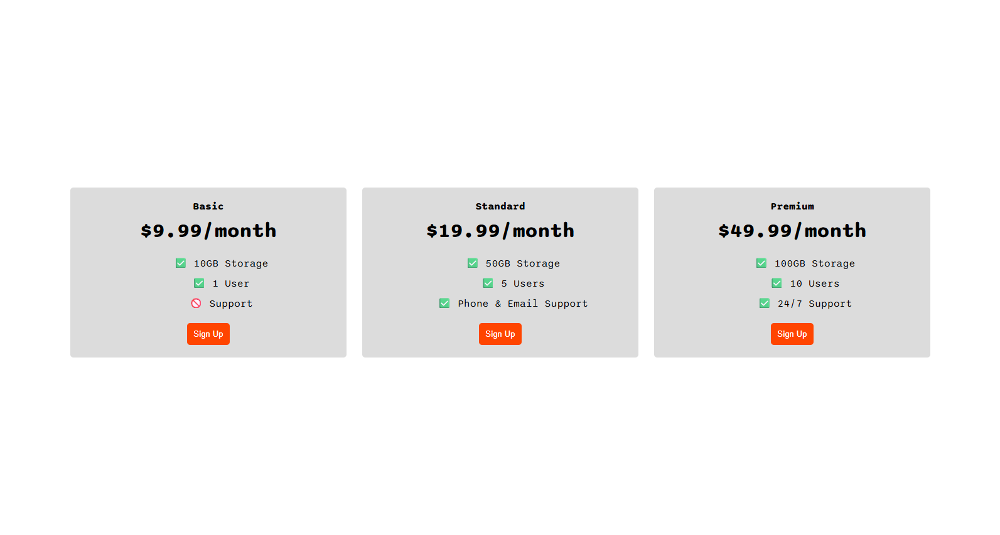
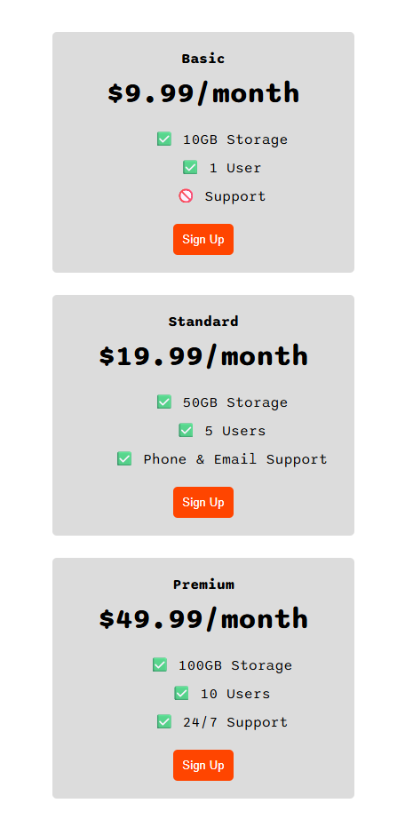

# Section 8: Flexbox

## Project : Pricing Table Project
A responsive Flexbox pricing table with three plans, built to adapt smoothly across screen sizes.

<div style="display: flex; align-items: flex-start; gap: 10px;">
  
  
</div>


## Key Points / What I Learned

- **Table Element**    
`<table>` → wraps the entire table  
`<tr>` → table row  
`<td>` → table data (cell)  
    ```html
    <!-- It's used to display tabular data (data in rows and columns), NOT for page layout (this is an old, outdated practice). -->
    <table>
        <tr class="row">
            <td class="col1">...</td>
            <td class="col2">...</td>
            <td class="col3">...</td>
        </tr>
    </table>
    ```
    ```css
    table {width: 100%;}
    .col1 {width: 25%;}
    .col2 {width: 25%;}
    .col3 {width: 40%;}
    ```

- **Using `float` and `inline-block` for Layout**  
    Both are older layout methods. Modern CSS uses Flexbox/Grid, but these are still useful to understand.
    ```html
    <div class="one"><p>...</p></div>
    <div class="two"><p>...</p></div>
    <div class="three"><p>...</p></div>
    ```
    
    ```css
    /* inline-block display property */
    div {
        display: inline-block; 
        background-color: blueviolet;
    }

    .one {width: 25%;}
    .two {width: 25%;}
    .three {width: 45%;}
    ```

    ```css
    /* float property */
    .one {
        float: left;
        width: 25%
    }
    .two {
        float: left;
        width: 25%
    }
    .three {
        float: left;
        width: 40%
    }
    ```

- **CSS Flexbox**  
    Flexbox lets you align elements side by side by applying `display: flex` to a parent container, which automatically turns its children into flexible layout items.
    ```html
    <!-- Wrap all items inside a flex container -->
    <div class="container">
        <div class="one"><p>...</p></div>
        <div class="two"><p>...</p></div>
        <div class="three"><p>...</p></div>
    </div>
    ```


    ```css
    /* Turn the container into a flexbox */
    .container {
        display: flex;
        gap: 1rem; /* adds space between items - (you can also use pixels) */
    }
    ```

    ```css
    /* display: inline-flex */
    .container {
        display: inline-flex;
        gap: 10px;
    }
    ```
    `flex` → most common, for full-width rows  
    - Acts like a block element - (the container, not the children)
    - Takes full width by default  
    - Starts on a new line  
    - Children become flex items

    `inline-flex` → for small menus, buttons, or icons in a line
    - Acts like an inline element  
    - Takes only as much width as its content  
    - Can sit next to text or other inline elements  
    - Children become flex items

- **Flex Direction** - Row and Column Layouts
    ```css
    .container {
        flex-direction: row | row-reverse; /* row is default */
        }
    /* Main axis → horizontal (left → right)
    Cross axis → vertical (top → bottom)
    Items are placed side by side in a row */
    ```

    ```css
    .container {
        flex-direction: column | column-reverse;
        }
    /* Main axis → vertical (top → bottom)
    Cross axis → horizontal (left → right)
    Items are stacked vertically */
    ```

    - *<u>Main axis</u>*  
    The direction flex items follow - Controlled by flex-direction  
    - *<u>Cross axis</u>*  
    Always perpendicular to the main axis  

- **Flex-Basis Property**  
    Sets the initial size of a flex item along the main axis (width in row direction, height in column direction), not the container.
    ```css
    .container {
        display: flex;
        gap: 10px;
        }

    .item {
        flex-basis: 100px;
    }
    ```

- **Flexible Layout**
    - **Order Property**  
        Applies to flex or grid child items, not the container. It controls the visual order of items within the container.
        ```css
        /* By default, all items have order: 0 */
        .green {
            order: 1; /* Higher values appear later (move toward the end) */
        }
        ```

    - **Flex-Wrap Property**  
        Controls whether flex items stay on one line or wrap onto multiple lines when there isn’t enough space.
        ```css
        .container {
            flex-wrap: nowrap; /* Default: items stay on one line and may overflow */
        }
        ```
        - `nowrap` (default): Items do NOT move to the next line and may overflow the container  
        - `wrap`: Items move onto the next line when needed  
        - `wrap-reverse`: Items wrap onto the next line in the reverse direction

    - **Justify-Content Property**  
        Applied to the flex container (parent). It controls how items are distributed along the main axis (horizontal by default).
        ```css
        .container {
            justify-content: flex-start; /* Default: items align at the start */
        }
        ```
        - `flex-start`: Items align at the start of the container - (default)
        - `flex-end`: Items align at the end of the container
        - `center`: Items are centered
        - `space-between`: Equal space between items
        - `space-around`: Equal space around items
        - `space-evenly`: Equal space between and around items

    - **Align-Items Property**  
        Applied to the flex container (parent). It controls how items are aligned along the cross axis (vertical by default).  
          
        Works on the cross axis (opposite of `justify-content`)  
        Default direction depends on `flex-direction`:  
        - row → vertical alignment  
        - column → horizontal alignment  
        ```css
        .container {
            display: flex;
            height: 70vh; /* vh: viewport height of the window */
            /* Without height, the container = same height as items → nothing moves. */
            align-items: center;
        }
        ```
        - `stretch`: Items stretch to fill the container (default)
        - `flex-start`: Items align at the start of the cross axis
        - `flex-end`: Items align at the end of the cross axis
        - `center`: Items are centered along the cross axis
        - `baseline`: Items align based on their text baseline (the invisible line where text “sits”)

    - **Align-Self Property**  
        Applied to a flex item (child). It overrides `align-items` for a single item.
        ```css
        .green {
            align-self: flex-start; /* uses same values as align-items */
        }
        ```

    - **Align-Content Property**  
        It only works when items go onto multiple lines `flex-wrap: wrap;` and controls the spacing between those lines (on the cross axis).
        ```css
        .container {
            flex-wrap: wrap;
            align-content: stretch | flex-start | flex-end | center | space-between | space-around | space-evenly;
            /* stretch is default */
            height: 70hv;
        }
        ```

- **Flex Sizing**  
    <u>Priority List</u> → `min-width / max-width` > `flex-basis` > `Width` > Content width
    ```css
    .container {
        display: flex;
        gap: 10px;
    }

    p {
        width: 100px;

        /* main flex sizing property */
        flex-basis: 200px; /* sets the initial size before flex shrinking/growing */
        

        /* limits the size range */
        min-width: 300px;
        max-width: 100px;

        /*
        Notes:
        - flex-basis defines the starting size in flex layout, overrides width
        - min-width prevents items from getting too small (always wins)
        - max-width prevents items from getting too large (always wins)
        - final size is always constrained between min and max
        */
    }
    ```

    - **Grow & Shrink**
        ```css
        .child-item {
            /* default values */
            flex-basis: auto; /* uses width if set, otherwise content size */
            /* 0 = starts from zero size (ignores content), each item get an equal size */

            flex-grow: 0; /* item does NOT grow */
            /* 1 = allows item to grow and take available space */

            flex-shrink: 1; /* item CAN shrink, after that overflow happens (if no wrap) */
            /* 0 = the item does NOT shrink at all when space is too small, it overflows the container (go off screen)*/

            /* Shorthand */
            flex: 1 1 0;  /* flex-grow, flex-shrink, flex-basis */
            flex: 1; /* shorthand for: flex: 1 1 0 */
            flex: 2; /* (grow = 2, shrink = 1, basis = 0) */
        }
        ```


## CSS Flexbox Cheatsheet
- [CSS Flexbox Layout Guide](https://css-tricks.com/snippets/css/a-guide-to-flexbox/)

## Testing Flex Properties
- [App Brewery - Flex Layout](https://appbrewery.github.io/flex-layout/)

## Interactive Game for Practicing Flexbox
- [Flexbox Froggy](https://appbrewery.github.io/flexboxfroggy/#el)

## Exercise on Flex Sizing
- [App Brewery Flexbox Sizing Exercise](https://appbrewery.github.io/flexbox-sizing-exercise/)
